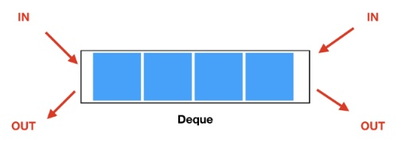

## 10828_스택
- 스택 및 스택 함수들 구현 
- 스택?
  - LIFO(Last In First Out) : 나중에 넣은 것이 먼저 나와.
#### 배운 것
- 파이썬 입력 방법
  - input() : 기본적인 입력 방법, 문자열로 처리됨. 
  - sys.stdin.readline() : 대량의 데이터를 반복적으로 입력받을 때. import sys 선언.
---
## 9093_단어뒤집기
- 문장의 단어들을 모두 뒤집어서 출력
#### 배운 것
- 리스트의 요소를 뒤집는 방법
  - reverse() : list타입 함수. 값을 반환하지 않고 list를 뒤섞는다,
  - reversed() : 내장함수. reversed객체를 반환하므로, 문자열인 경우 ''.join(reversed(문자열))
---
## 9012_괄호
- ps(괄호 문자열) 중 vps인 경우 Yes 출력.
- '('인 경우 stack에 append하고, ')'인 경우 stack.pop을 함. stack이 비어있다면 vps.
#### 런타임 에러(IndexError)
- 어려운 문제가 아닌 것 같았는데, 자꾸 런타임 에러가 나서 해결하느라 시간이 걸림. ㅠㅠ
- 내가 고려하지 못했던 것
  1. '(()))' 인 경우 stack이 비어있는데 pop을 해야하는 상황
    => pop을 하기 전 stack이 empty인 경우 반복문을 중단하게 만듦.
  2. 그냥 반복문을 중단하면, stack이 왜 empty인지 모름. vps여서? 반복문 중단되서?
    => isEmpty 라는 boolean 변수를 확인해, 이 변수가 true값이면 vps 아님.
---
## 1874_스택 수열
- 주어진 수열을 스택을 통해 만들 수 있는지 판단하는 문제. (스택에는 1부터 오름차순으로 push해야함.)
#### 풀이 전략 
- count라는 변수. 이 변수는 현재 스택에 넣은 숫자중 최댓값. 
- 수열 원소값 >= count : push
- 수열 원소값 == 스택 최상위값 : pop 
- 스택 최상위값을 pop할 수 없다면, 스택으로 수열을 만들 수 없음 => NO
#### 배운 것
- 전략의 중요성... 코드 구현하기 전에 알고리즘을 명확히 짜고 시작할 것!
- list=[1,2,3] 일때 list[-1]은 3, list[-2]는 2..
---
## 1406_에디터
- 간단한 에디터를 구현. 
#### 풀이 전략 
- 2개의 스택을 설정하고 이를 이용해 풀면 매우 간단.
---
## 10845_큐
- 큐 및 큐 함수들 구현 
- 큐?
  - FIFO(First In First Out) : 먼저 넣은 것이 먼저 나와.
#### 풀이 전략
- 파이썬에서 제공하는 queue 모듈이 있지만, list로 구현.
- 큐의 pop은 list.pop(0)으로. => 시간복잡도 O(n)이라 시간 오래걸림.
---
## 1158_요세푸스 문제
#### 풀이 전략
- 스택으로 구현하려고 했으나 pop(0)으로 인해 시간 초과
- deque로 구현할 예정
---
## 10866_덱

#### 풀이 전략 
- from collections import deque : 파이썬에서 deque Object 제공
  - 왼쪽(앞)에서 추가/제거 : appendleft(a), popleft(a), deque[0]
  - 오른쪽(뒤)에서 추가/제거 : append(a), pop(a), deque[len(deque)-1]
---
## 17413_단어 뒤집기 2
